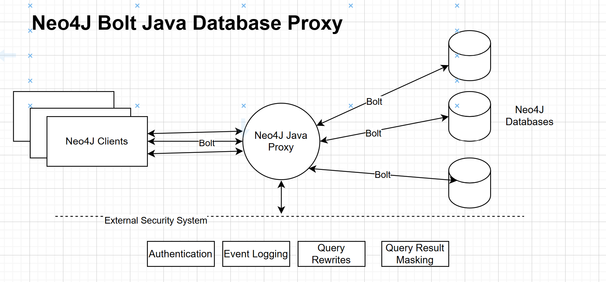

# Mamori.io Neo4j Bolt database proxy

Project Brief/Requirements:

Build a secure, responsive J2SE Neo4J/Bolt proxy that proxies communication between
Neo4j clients databases and external security systems. The proxy should utilise and communicate using the Neo4j on-the-wire 
client-server network protocol (Bolt).

Targets:
* Neo4j version 2025.07.1. Website: https://neo4j.com/
* Network protocol Bolt https://neo4j.com/docs/bolt/current/bolt/

The purpose of the proxy is to support:

1. External authentication
2. External notification of session and statement events. e.g connections and queries
3. External notification of session and query errors
4. External rewriting of queries
5. External masking of query results

## Interaction Diagram



External system interfaces and helper classes are available at  https://github.com/mamori-io/base-db-proxy

Base db proxy Maven dependency:
```xml
<dependency>
    <groupId>io.mamori</groupId>
    <artifactId>proxy-base</artifactId>
    <version>1.0-SNAPSHOT</version>
</dependency>
```

## Neo4j Resources
* Neo4j Community Edition https://github.com/neo4j/neo4j
* Example datasets https://neo4j.com/docs/getting-started/appendix/example-data/
* Demo  https://demo.neo4jlabs.com:7473
* Java Driver: https://github.com/neo4j/neo4j-java-driver
* Java embedded example with Bolt Driver https://github.com/neo4j/neo4j-documentation/blob/dev/embedded-examples/src/main/java/org/neo4j/examples/EmbeddedNeo4jWithBolt.java
* Bolt protocol https://neo4j.com/docs/bolt/current/bolt/

# Definition of done
* Support common neo4j clients: neo4j-client CLI, Neo4j Desktop and Neo4j Browser (Bolt protocol only)
* Demonstrate running with the Neo4J sample application (movies-java-bolt) https://github.com/neo4j-examples/movies-java-bolton on a local Neo4J database via the proxy.
* Demonstrate running with the Java embedded example using Bolt. https://github.com/neo4j/neo4j-documentation/blob/dev/embedded-examples/src/main/java/org/neo4j/examples/EmbeddedNeo4jWithBolt.java
* Ideally, demonstrate running with the  Neo4J Java Unit Tests: https://github.com/neo4j/neo4j-java-driver/tree/6.x/examples/src/main/java/org/neo4j/docs/driver
* Meet throughput and scaling targets
* Utilise the base proxy interfaces for connection and statement/query logging, query rewrites and result masking
* Produce an OWASP report
* Produce a spot bugs report. Run using: mvn spotbugs:check

Your project should include the following deliverables:

* All source (in /src) with appropriate javadoc
* Comprehensive JUnit Tests for successful and unsuccessful scenarios (in /test) 
* Comprehensive JUnit Tests using Neo4j sample datasets https://neo4j.com/docs/getting-started/appendix/example-data/ with clients running the  https://github.com/neo4j/neo4j-java-driver driver.

Note, you are free to use the https://github.com/neo4j/neo4j-java-driver (Bolt) in any test or test client, but cannot use the driver in
the proxy itself. For network protocol operations use Netty.

## Reference Redis Project
A reference Redis database proxy project is available as a guide to implementation and how to incorporate the external interfaces and
classes into your proxy code https://github.com/mamori-io/redis-db-proxy

## Throughput/Scaling Targets
* Support 500 Concurrently Connected Clients/Sessions.
* Add no more than a 5% overhead on network/Bolt operations.
* Scale linearly

## What's provided in this project
* Sample maven file pom.xml
* Base packages (empty)
* OWASP configuration
* SpotBugs configuration

### External System interfaces

The Proxy base interfaces, classes and unit test helpers are available at https://github.com/mamori-io/base-db-proxy

* TargetSystemConnectionDetailProvider. Main interface for connecting, authenticating and  logging.
* Session. Implement this interface for Neo4J sessions.
* SessionEvent. Session events. Use the Session.event callback to notify of session events. 
* Query interface. Implement this interface for Neo4J queries. Invoke the rewrite and mask functions for rewriting and masking queries.
* StatementEvent. Query events. Use the Query.progress callback to notify of Query/Statement Events.

## Technology Stack
* Java 24+
* JUnit 5.X for testing
* maven for builds.
* Netty https://netty.io/ for network packet encoding and decoding operations.
* logback and slf4j for logging

## Design/Implementation Guidelines
* Use Asynchronous/non-blocking programming and structures e.g CompletableFutures.
* Catch and log all exceptions. No empty catch clauses.
* The base package for all proxy classes is *io.mamori.proxy.neo4j*.
* Use Netty threading model/platform threads.
* Minimise 3rd party dependencies. No inclusion of 3rd party libraries with viral licences e.g GPL, AGPL etc.
* Do not use Spring.

See [pom.json](pom.xml)

# Need more Info?
Contacts: omasri@mamori.io and dparnell@mamori.io

